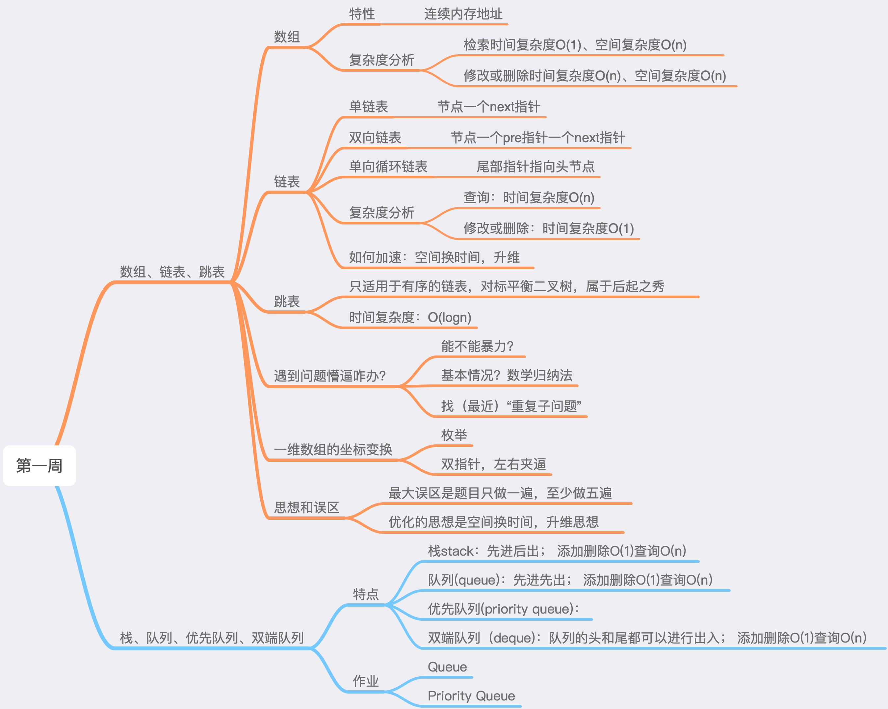
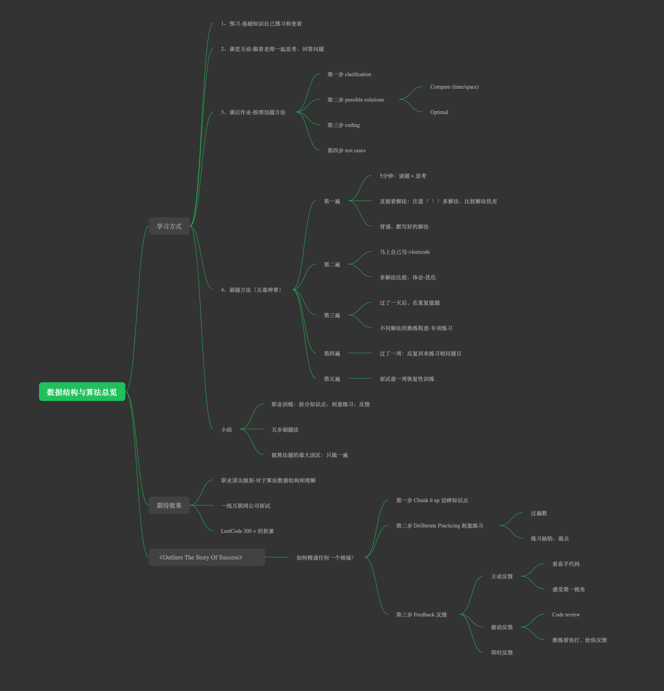

# 学习笔记
## MD语法笔记脑图

## 第一周学习笔记脑图

## 学习心得
### 如何高效学习算法
1. 3分视频理解 + 7分练习
2. 学习方法上：
    * 改变自己的学习习惯（不要死磕，敢于死记硬背优秀题解）
    * 五毒神掌法（重要的是过遍数，刷题大于5遍，而不是每次花很长时间）
    * 不要死磕AC了事，要看高票代码和高质量解题
    * 最大的误区：做题只做一遍！！！
3. 第一周的困境：思路考虑不周全，不看题解无法解题，虽然也在过遍数，目前效率较低。个人时间管理上还是不够好，需要优化，保证学习时间。
4. 自勉：你不会做的题总有人会做，而且会做得更好，你吃不了的苦，总有人能够吃更多，那最后，只能看着别人越来越优秀！