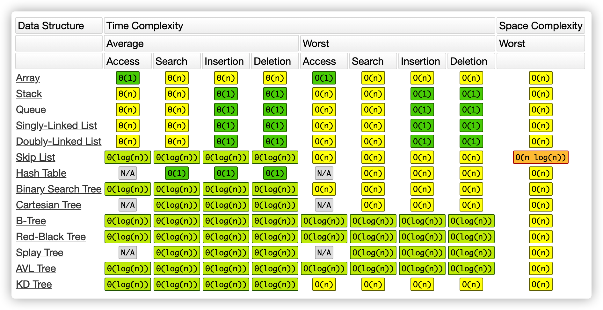
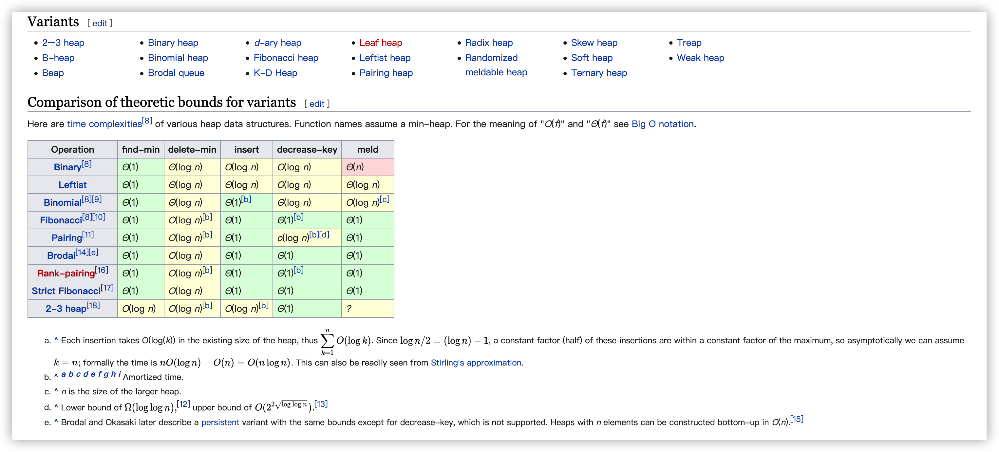

学习笔记

# Map接口
* HashMap
	1. get和put时间复杂度O(1)
	2. 合理设置初始容器大小。负载因子为0.75？时间和空间考量，减少rehash
	3. 提高性能应尽可能优化减少哈希碰撞。
	4. 允许null
	5. 线程不安全。如何线程安全？`Map m = Collections.synchronizedMap(new HashMap(...));`
* TreeMap
	1. 红黑树结构
	2. 依据不同的构造函数，插入元素用它的自然排序或者它的比较器进行排序。
	3. 线程不安全。如何线程安全？`SortedMap m = Collections.synchronizedSortedMap(new TreeMap(...));`
# Set接口
1. 不允许重复元素，无序
2. 如何判断重复？hashCode()和equal()
3. 主要实现类：
	* HashSet哈希表结构，主要利用HashMap的key来存储元素，计算元素的hashCode来获取元素在集合中的位置
		1. 插入、删除、查询时间复杂度O(1)
		2. 如果追求迭代器性能，不要设置初始化大小过高
		3. 线程不安全。如何线程安全？`Set s = Collections.synchronizedSet(new HashSet(...));`
	* TreeSet红黑树结构，基于TreeMap实现，依据不同的构造函数，插入元素用它的自然排序或者它的比较器进行排序。
		1. 插入、删除、查询时间复杂度为O(logN)
		2. 线程不安全。如何线程安全？`SortedSet s = Collections.synchronizedSortedSet(new TreeSet(...));`

# [Fail-fast与fail-safe](https://www.jianshu.com/p/b41a886e0257)
* fail-fast机制
1. 迭代器遍历元素的过程中，集合结构发生改变，抛出ConcurrentModificationException异常防止继续遍历。
2. 结构发生改变？插入、删除元素。注意修改元素不算。
3. 如何避免？可以在涉及到会影响到modCount值改变的地方，加上同步锁(synchronized),或者直接使用Collections.synchronizedList来解决。
* fail-safe机制
1. 当集合结构发生改变的时候，复制一份副本，遍历副本，不会抛出异常。
2. 缺点：时间和空间开销大；不能保证数据最新。

# Tree
* 现实中用的最多的就是二叉树
* LinkedList就是特殊化的Tree，因为有两个next指针
* Tree是特殊化的Graph，因为没有环
* 二叉树遍历
> 树的遍历只能用递归、没办法有效的进行循环
> 
	1. 前序遍历（pre-order）:根-左-右
	2. 中序遍历（in-order):左-根-右
	3. 后序遍历（post-order）：左-右-根
* 代码模板
```
// 前序遍历
def preorder(self,root):
    if root:
        self.traverse_path.append(root,val)
        self.preorder(root.left)
        self.preorder(root.right)
// 中序遍历
def inorder(self,root):
    if root:
        self.inorder(root.left)
        self.traverse_path.append(root,val)
        self.inorder(root.right)
// 后序遍历
def postorder(self,root):
    if root:
        self.postorder(root.left)
        self.postorder(root.right)
        self.traverse_path.append(root,val)
```
* 
# 二叉搜索树Binary Search Tree
* 概念：也称二叉排序树、有序二叉树、排序二叉树，是指一颗空树或者具有以下性质的二叉树：
	1. 左子树上***所有节点***的均值均小于它的根节点的值
	2. 右子树上***所有节点***的均值均大于它的根节点的值
	3. 以此类推：左右子树也分别为二叉查找树。（重复性）
	4. 它的中序遍历是升序遍历
	5. [可视化二叉树操作演示](https://visualgo.net/zh/bst)
# Tree的面试题解法一般都是递归，为什么？
* 递归：通过函数体来进行的循环。
* 向下进入到不同的层、向上返回到原来的层
* 对称性：他不能跳跃、只能层层下去再层层返回原来的层
* 例子：阶乘、递归代码模板（前中后序遍历）
# [HeapSort](https://www.geeksforgeeks.org/heap-sort/)
# 递归 Recursion
* 步骤
	* 递归终止条件
	* 处理当前层的业务逻辑
	* 下到下一层
	* 递归完了、清理当前层
* 思维递归
	* 不要画递归的状态图
	* ***找到最近最简单的方法、将其拆成可重复解决的问题（重复子问题）***
	* ***数学归纳法***
	
# 总结
* 本周感受是相对于第一周不看题解无法做题情况有所改善，能够对一些做过的题目进行独立解题
* 学习算法过程中，总是会发现解题相关的一些知识点不懂，需要看各种相关知识，虽然这也是有表要的，但注意力也就发生了分散，继续分散，最后相对算法的时间比例就低了。
* 针对上面发现的问题，对自我的改进建议是，放弃过度发散看其它知识点，专注算法知识点，在解题的遍数中体会。
	
***
# 需要补充堆和二叉堆的实现和特性笔记
* 堆(Heap):可以迅速找到一堆数中的***最大***或***最小***的数据结构
* 将根节点最大的堆叫大顶堆或大根堆，根节点最小的堆叫做小顶堆或小根堆。常见的堆有二叉堆、斐波那契堆等。
* [不同实现的堆比较](https://en.wikipedia.org/wiki/Heap_(data_structure))

* [堆的实现代码](https://shimo.im/docs/Lw86vJzOGOMpWZz2/read)
* 用途场景举例：任务流最高优先级先处理
# 二叉堆
* 二叉堆相对容易，但复杂度性能这块刚刚及格并不是最优
* ***通过完全二叉树来实现***，注意不是二叉树搜索树
* 大顶堆性质：是一颗***完全二叉树***且树中任意节点的值总是大于等于其子节点的值
* 实现细节：
    * 二叉堆一般都是通过数组来实现
    * 假设第一个元素在数组中的索引为0的话，则父节点和子节点的位置关系一定满足如下
        1. 索引为i的左孩子的索引是 2*i+1
        2. 索引为i的右孩子的索引是 2*i+2
        3. 索引为i的父节点的索引是 floor((i-1)/2)
    * insert插入操作
        1. 新元素一律插入到堆的尾部
        2. 依次上香调整整个堆的结构（一直到根即可）HeapifyUp
    * 删除最大值操作
        1. 将堆尾元素替换到顶部（即对顶被替代删除掉）
        2. 依次从根部向下调整整个对的结构（一直到堆尾即可） HeapifyDown


